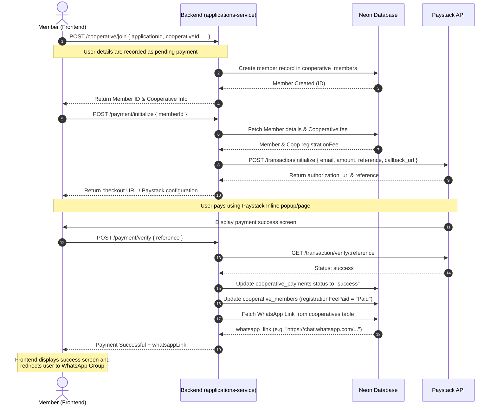

# Cooperative Join, Pay & WhatsApp Redirection Architecture

This document details the architectural design and system flow to enable cooperative members to register, pay their registration/contribution fees via **Paystack** (or a similar payment gateway), and automatically receive the invitation link to join the specific WhatsApp group for their cooperative.

---

## 1. Core Objectives
1. **Authorized Access Only**: Protect WhatsApp invitation links by only revealing them to members who have successfully completed their registration fee payment.
2. **Seamless UX**: Automate the transition from Registration $\rightarrow$ Payment $\rightarrow$ Redirection to WhatsApp.
3. **Database Integrity**: Store payment receipts, link cooperative members to their transactions, and associate unique WhatsApp invite links with each of the 488+ cooperatives.

---

## 2. Database Schema Enhancements

To support this flow, we will modify the database schema (`schema.ts`) in the `applications-service` or shared DB schema:

### 1. Update `cooperatives` Table
Add a column to store the specific WhatsApp invite link for each LGA/cooperative:

```typescript
// services/applications-service/src/db/schema.ts
export const cooperatives = pgTable("cooperatives", {
  id: uuid("id").primaryKey().defaultRandom(),
  name: varchar("name", { length: 255 }).notNull().unique(),
  state: varchar("state", { length: 100 }).notNull(),
  description: text("description"),
  locationId: varchar("location_id", { length: 100 }),
  regionId: varchar("region_id", { length: 100 }),
  zone: varchar("zone", { length: 150 }),
  lga: varchar("lga", { length: 100 }),
  isActive: boolean("is_active").notNull().default(true),
  
  // NEW: WhatsApp Invite Link
  whatsappLink: varchar("whatsapp_link", { length: 255 }),
  
  // NEW: Optional configuration per coop (e.g. registration fee amount)
  registrationFee: integer("registration_fee").default(2000), // in NGN (kobo/minor units preferred or flat Naira)
  
  createdAt: timestamp("created_at").notNull().defaultNow(),
  updatedAt: timestamp("updated_at").notNull().defaultNow(),
});
```

### 2. Create `cooperative_payments` Table
Create a table to log and audit payment attempts and successful transactions:

```typescript
// services/applications-service/src/db/schema.ts
export const paymentStatusEnum = pgEnum("payment_status", ["pending", "success", "failed"]);

export const cooperativePayments = pgTable("cooperative_payments", {
  id: uuid("id").primaryKey().defaultRandom(),
  memberId: uuid("member_id").references(() => cooperativeMembers.id).notNull(),
  amount: integer("amount").notNull(), // Amount paid in minor unit (kobo)
  currency: varchar("currency", { length: 10 }).default("NGN").notNull(),
  reference: varchar("reference", { length: 100 }).notNull().unique(), // Paystack txn reference
  status: paymentStatusEnum("status").default("pending").notNull(),
  metadata: jsonb("metadata"), // Raw response details from Paystack
  createdAt: timestamp("created_at").notNull().defaultNow(),
  updatedAt: timestamp("updated_at").notNull().defaultNow(),
});
```

---

## 3. Sequence Flow Diagram

The following diagram illustrates the complete workflow:



---

## 4. Detailed Backend Implementation

### Endpoints Required:

#### 1. `POST /payment/initialize`
Initiates a checkout reference using the Paystack SDK/API.

```typescript
import axios from "axios";

router.post("/payment/initialize", async (req: Request, res: Response) => {
  const { memberId } = req.body; // memberId from cooperative_members
  
  try {
    // 1. Fetch member and the cooperative details
    const [member] = await db
      .select()
      .from(cooperativeMembers)
      .where(eq(cooperativeMembers.id, memberId))
      .limit(1);

    if (!member) return res.status(404).json({ error: "Member not found" });

    const [coop] = await db
      .select()
      .from(cooperatives)
      .where(eq(cooperatives.id, member.cooperativeId))
      .limit(1);

    const feeAmount = coop?.registrationFee || 2000; // default 2,000 NGN
    const paystackAmount = feeAmount * 100; // Paystack accepts amount in Kobo

    // 2. Generate a unique transaction reference
    const reference = `COOP-PAY-${memberId}-${Date.now()}`;

    // 3. Log a pending payment in the database
    await db.insert(cooperativePayments).values({
      memberId: member.id,
      amount: paystackAmount,
      reference,
      status: "pending",
    });

    // 4. Initialize transaction with Paystack
    const paystackResponse = await axios.post(
      "https://api.paystack.co/transaction/initialize",
      {
        email: member.email || "support@oriyoninternational.com",
        amount: paystackAmount,
        reference,
        callback_url: `${process.env.FRONTEND_URL}/cooperative/payment-callback`,
      },
      {
        headers: {
          Authorization: `Bearer ${process.env.PAYSTACK_SECRET_KEY}`,
          "Content-Type": "application/json",
        },
      }
    );

    return res.json({
      authorization_url: paystackResponse.data.data.authorization_url,
      reference,
    });
  } catch (error: any) {
    console.error("Payment init error:", error.response?.data || error.message);
    return res.status(500).json({ error: "Unable to initialize payment" });
  }
});
```

#### 2. `POST /payment/verify`
Verifies payment on the backend, updates database state, and retrieves the secure WhatsApp redirect link.

```typescript
router.post("/payment/verify", async (req: Request, res: Response) => {
  const { reference } = req.body;

  try {
    // 1. Fetch payment log
    const [payment] = await db
      .select()
      .from(cooperativePayments)
      .where(eq(cooperativePayments.reference, reference))
      .limit(1);

    if (!payment) return res.status(404).json({ error: "Payment transaction not found" });

    // If already marked as success, skip double network calls and return details
    if (payment.status === "success") {
      const [member] = await db.select().from(cooperativeMembers).where(eq(cooperativeMembers.id, payment.memberId)).limit(1);
      const [coop] = await db.select().from(cooperatives).where(eq(cooperatives.id, member.cooperativeId)).limit(1);
      return res.json({ status: "success", whatsappLink: coop?.whatsappLink });
    }

    // 2. Call Paystack API to verify status
    const paystackResponse = await axios.get(
      `https://api.paystack.co/transaction/verify/${reference}`,
      {
        headers: { Authorization: `Bearer ${process.env.PAYSTACK_SECRET_KEY}` },
      }
    );

    const data = paystackResponse.data.data;

    if (data.status === "success") {
      // 3. Update payment status
      await db
        .update(cooperativePayments)
        .set({ status: "success", metadata: data, updatedAt: new Date() })
        .where(eq(cooperativePayments.id, payment.id));

      // 4. Update member's registration status
      await db
        .update(cooperativeMembers)
        .set({ registrationFeePaid: "Paid" })
        .where(eq(cooperativeMembers.id, payment.memberId));

      // 5. Fetch the linked cooperative's WhatsApp link
      const [member] = await db
        .select()
        .from(cooperativeMembers)
        .where(eq(cooperativeMembers.id, payment.memberId))
        .limit(1);

      const [coop] = await db
        .select()
        .from(cooperatives)
        .where(eq(cooperatives.id, member.cooperativeId))
        .limit(1);

      return res.json({
        status: "success",
        whatsappLink: coop?.whatsappLink || "https://chat.whatsapp.com/default-placeholder-link",
      });
    } else {
      return res.json({ status: data.status, message: "Payment was not successful" });
    }
  } catch (error: any) {
    console.error("Payment verification error:", error.response?.data || error.message);
    return res.status(500).json({ error: "Verification failed" });
  }
});
```

---

## 5. Frontend Workflow Integration

### A. Integrated Payment Popup (Recommended for best conversion)
Using **Paystack Inline JS** or React library, users complete the transaction directly on the site without redirecting away:

1. **Submit Join Form**: Users enter legal details and choose their cooperative. Clicking "Join Cooperative" invokes `POST /cooperative/join`.
2. **Trigger Paystack Inline SDK**:
   ```javascript
   import { usePaystackPayment } from 'react-paystack';

   const config = {
     reference: transactionReference, // received from POST /payment/initialize
     email: userEmail,
     amount: feeAmount * 100, // in kobo
     publicKey: 'pk_live_...',
   };

   const initializePayment = usePaystackPayment(config);

   const onSuccess = (reference) => {
     // Verify on backend
     verifyPaymentOnBackend(reference.reference);
   };
   ```
3. **Handle Backend Verification & Redirection**:
   On backend verification success:
   - Play a success sound/confetti.
   - Redirect the window to the returned WhatsApp invite link:
     ```javascript
     window.location.href = res.data.whatsappLink;
     ```

### B. Fallback Redirect Flow
If using standard redirect URLs:
- Backend initialization returns an `authorization_url`.
- Frontend redirects user: `window.location.href = authorization_url`.
- User completes payment on Paystack's page.
- Paystack redirects back to `FRONTEND_URL/cooperative/payment-callback?reference=XXXX`.
- The callback page displays a spinner, invokes `POST /payment/verify`, gets the WhatsApp link, and triggers:
  ```javascript
  // Show a success animation and redirect
  setTimeout(() => {
    window.location.href = whatsappLink;
  }, 2000);
  ```

---

## 6. Admin Panel Operations

In the Admin Dashboard, the Admin can:
1. **Assign WhatsApp Link**: Add/edit the WhatsApp invite link for each cooperative in the edit cooperative modal.
2. **Audit Payments**: View the logs of payments (reference, user name, state, timestamp, status).
